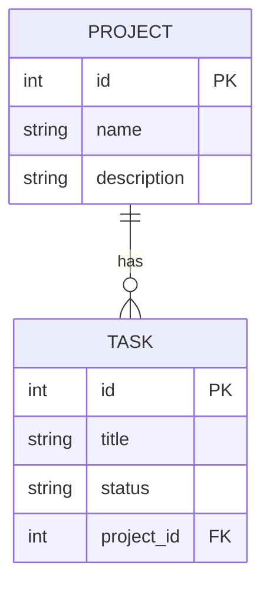

# Django-Supabase Task Manager

## 🛠 Tech Stack
- **Backend:** Django (Python)
- **Database:** Supabase (PostgreSQL)
- **Documentation:** Mermaid.js

## 📊 Database Schema

```mermaid
erDiagram
    PROJECT ||--o{ TASK : has
    PROJECT {
        int id PK
        string name
        string description
    }
    TASK {
        int id PK
        string title
        string status
        int project_id FK
    }
```