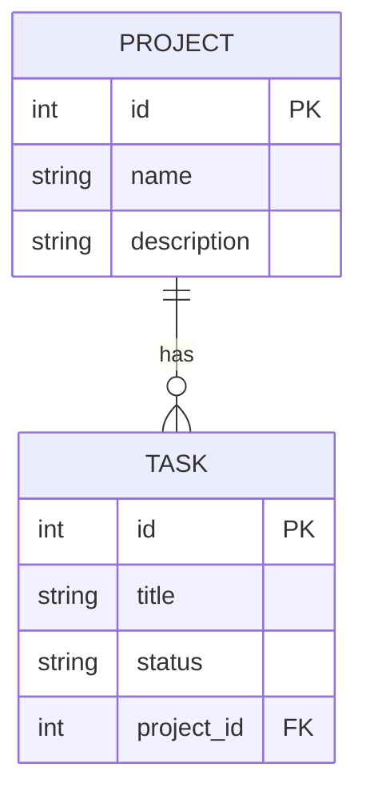

# Django-Supabase Task Manager

## 🛠 Tech Stack
- **Backend:** Django (Python)
- **Database:** Supabase (PostgreSQL)
- **Documentation:** Mermaid.js

## 🚀 Getting Started
1. Clone the repo: 
   ```bash
   git clone https://github.com/labanimukherjee42-hub/django-supabase-task-manager.git
   ```
2. Install dependencies: 
   ```bash
   pip install -r requirements.txt
   ```
3. Run migrations: 
   ```bash
   python manage.py migrate
   ```
4. Start server: 
   ```bash
   python manage.py runserver
   ```

## 📊 Database Schema
